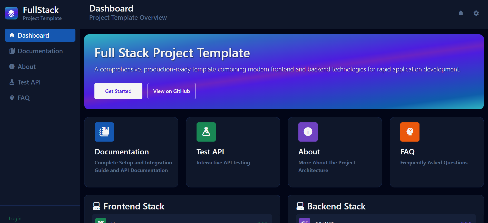

# **Full Stack Project Template**

### For Vue.js + TypeScript & C#/.NET Full Stack Projects



---

## Table of Contents
- [Features](#features)
- [Stack/Technologies used](#tech)
- [Setup/Launch Guide](#setup/launch-guide)
- [File Structure](#file-structure)
- [FAQ](#faq)
- [Licensing](#licensing)
----

## Features

- Simple "_plug-and-play_" setup to cut project start time down to 1/10th of what it used to be.
- **Organized & clear** directory structure.
- Easy **Auth0** and **MySQL Database** Integration.
- **pre-built scripts** to make setup and **EF migrations** simpler than ever!
- Pre-built Example site to assist in **API endpoint testing**, **learning**, and **quickly getting started**.
- RESTful API with Swagger docs
- All the tools needed right from the start to build a **production ready** application.
----
## Tech

##### **Frontend**

- **[Vue 3]** - Progressive Framework for reactive SPAs.
- **[Vue Router]** - Configurable and convenient routing for Vue.
- **[TypeScript]** - Strongly Typed language that builds on JavaScript.
- **[Pinia]** - Intuitive state management built for Vue.
- **[Axios]** - Promise based HTTP client for the browser.
- **[SASS]** - CSS preprocessor to extend the capabilities of CSS.
- **[ESLint]** - Linting utility for locating bugs faster.
- **[Bootstrap]** - HTML, CSS, and JS Library for quick and responsive web applications.
- **[Auth0]** - An easy to implement authentication and authorization platform.
- **[MDI]** - Material Design Icons.

##### **Backend**

- **[.NET]** - Cross-platform framework for web APIs and services.
- **[C#]** - OOP language for developing .NET apps.
- **[Entity Framework Core]** - ORM for database access through C# models.
- **[Swashbuckle]** - Interactive Swagger API documentation.
- **[Auth0 Provider]** - Middleware for validating and authorizing Auth0-issued tokens.
---

## Setup/Launch Guide


#### 1. Clone the Template
1. click "use this template" in the [github repo](https://github.com/a-rossman0825/fs-template).
2. Name & Create your repository.
3. Get the Https url or SSH key from the "Code" dropdown on your github repository.
4. in the desired directory, run: 
    ```bash
    git clone <your_url_or_key>
    ```
5. **Before doing anything else, in your project root run:**
    ```bash
    node setup.js
    ```
    
#### 2. Install dependencies
    ```bash
    cd client
    npm install
    cd ../server
    dotnet restore
    cd ..
    ```
    
#### 3. Create Your Auth0 Application & API
1. On your [Auth0 Dashboard](https://auth0.com/) create a Single Page Web Application.
2. Fill out your Callback urls as follows:
    ```
    http://localhost:8080, https://localhost:8080, http://localhost:8080/callback, https://localhost:8080/callback
    ```
3. Fill out your Logout **and** Web Origins urls as follows:
    ```
    http://localhost:8080, https://localhost:8080
    ```
4. in the Applications tab on your Auth0 Dashboard, click APIs and Create a new API.
5. Enable "RBAC" and "Add Permissions in the Access Token" in your API settings.

#### 4. Create Your MySQL Database (If you haven't already).

#### 5. Update env.ts
1. In VS Code in the project workspace, move into the client/src/ folder and create a file named "env.ts".
3. copy the contents of "env.local.ts" into your "env.ts" file.
2. Update domain, clientId, and audience with your auth0 application & API variables (audience is your API Identifier) in your env.ts file.

#### 6. Create Server Connection
1. In VS Code in the project workspace, move into the server/ folder.
2. Create a file named "appsettings.Development.json".
3. Copy "appsettings.json" contents into your "appsettings.Development.json" file.
4. Fill out the DefaultConnection (with your database connection string).
5. Fill out the AUTH_DOMAIN and AUTH_AUDIENCE keys (with your Auth0 variables).


#### 7. Run Your First Migration
1. in your project's root directory run the following bash scripts:
    ```
    chmod +x ./scripts/migrate.sh
    .scripts/migrate.sh (migration_name eg: example_init_migration).
    ```
    
#### 8. Run Your Test Servers
1. Using the Run & Debug Extension in VS Code, Start .NET Core launch (web) (server)
2. In your browser, check https://localhost:7045 for swagger docs.
3. Using the Run & Debug Extension, Start "Client".
4. In your browser, check http://localhost:8080 for application dashboard.

#### 9. Clear the Example Files

###### Client side
1. Once you're done looking around, Delete the "ExampleStuff" folder in client/src/components.
2. In client/src/pages, delete any pages you will not use (eg: DocPage, ExamplePage, FaqPage).
3. In client/router.js delete any page routes you will not use.
4. In client/src/ delete any files that contain the word "Example" in their name.
5. In client/src/assets/scss/style.scss clear any style classes you will not use.
6. In client/src/App.vue Delete <NavSideBar/> and <NavTopBar/> tags & their scss classes on the bottom of the file.
7. In client/src/pages/HomePage.vue Delete everything inside the script, template, and style tags.

###### Server side
1. In server/ delete all files with "Example" in it's name.
2. In server/Startup.cs delete any service/repository registrations with "Example" in it's name (eg: services.AddScoped<ExampleService>)(); ).
3. In server/Data/AppDbContext.cs delete the "Example" DBSet.
4. In the root project folder, run:
    ```bash
    .scripts/migrate.sh (migrationName)
    ```
     to remove the Example table from your database.

#### 10. Enjoy Building!
---

## File Structure

```bash
    .
└── fs-template/
    ├── client/
    │   ├── .vscode/
    │   │   ├── client-snippets.code-snippets
    │   │   └── launch.json
    │   ├── @types/
    │   │   ├── shims-vue.d.ts
    │   │   └── vue-eslint-config-typescript.d.ts
    │   ├── public/
    │   │   ├── img/
    │   │   │   └── .gitkeep
    │   │   └── .nojekyll
    │   ├── src/
    │   │   ├── assets/
    │   │   │   ├── img/
    │   │   │   │   └── anthony's-logo.png
    │   │   │   └── scss/
    │   │   │       ├── _main.scss
    │   │   │       ├── _variables.scss
    │   │   │       └── style.scss
    │   │   ├── components/
    │   │   │   ├── ExampleStuff/
    │   │   │   │   ├── HeroCard.vue
    │   │   │   │   ├── NavSideBar.vue
    │   │   │   │   ├── NavTopBar.vue
    │   │   │   │   ├── OverviewCard.vue
    │   │   │   │   ├── PageCard.vue
    │   │   │   │   └── StackCard.vue
    │   │   │   └── Login.vue
    │   │   ├── models/
    │   │   │   ├── Account.ts
    │   │   │   └── Example.ts
    │   │   ├── pages/
    │   │   │   ├── HomePage.vue
    │   │   │   ├── AboutPage.vue
    │   │   │   ├── DocPage.vue
    │   │   │   ├── ExamplePage.vue
    │   │   │   └── FaqPage.vue
    │   │   ├── services/
    │   │   │   ├── AccountService.ts
    │   │   │   ├── AuthService.ts
    │   │   │   ├── AxiosService.ts
    │   │   │   └── ExampleService.ts
    │   │   ├── stores/
    │   │   │   ├── AuthStore.ts
    │   │   │   └── ExampleStore.ts
    │   │   └── utils/
    │   │       ├── Logger.ts
    │   │       ├── Pop.ts
    │   │       └── registerGlobalComponents.ts
    │   ├── .gitignore
    │   ├── eslint.config.ts
    │   ├── index.html
    │   ├── package.json
    │   ├── Readme.md
    │   ├── tsconfig.json
    │   └── vite.config.ts
    ├── server/
    │   ├── .vscode/
    │   │   ├── launch.json
    │   │   ├── server-snippets.code-snippets
    │   │   └── tasks.json
    │   ├── Controllers/
    │   │   ├── AccountController.cs
    │   │   └── ExampleController.cs
    │   ├── Data/
    │   │   └── AppDbContext.cs
    │   ├── DTOs/
    │   │   ├── AccountDTO.cs
    │   │   └── ExampleDTO.cs
    │   ├── Migrations/
    │   ├── Models/
    │   │   ├── Account.cs
    │   │   └── Example.cs
    │   ├── Properties/
    │   │   └── launchsettings.json
    │   ├── Repositories/
    │   │   ├── AccountsRepository.cs
    │   │   └── ExamplesRepository.cs
    │   ├── Services/
    │   │   ├── AccountService.cs
    │   │   └── ExampleService.cs
    │   ├── wwwroot/
    │   │   └── index.html
    │   ├── .gitignore
    │   ├── appsettings.json
    │   ├── Globals.cs
    │   ├── Program.cs
    │   ├── server.csproj
    │   └── Startup.cs
    ├── scripts/
    │   └── migrate.sh
    └── docs/
        └── dirTree.md
```
---

#### FAQ

**Q: What is this template built for?**  
A: It’s a full stack starter kit for building modern web apps with Vue 3, TypeScript, and .NET backed by MySQL and Auth0 authentication.

**Q: Can I replace MySQL with another database?**  
A: Yes. Update the connection string and Entity Framework provider to match your preferred database.

**Q: Do I need an Auth0 account to run it?**  
A: Yes. Authentication and authorization rely on Auth0 configuration for both the SPA and API.

**Q: How do I reset the database?**  
A: Drop the database in MySQL, recreate it, and rerun the migration script from the root directory.

**Q: Can I use this in production?**  
A: Yes, after removing all example content, setting secure Auth0 credentials, and configuring production environment variables.

**Q: Why does Swagger show 401 errors for protected routes?**  
A: Those routes require a valid Auth0 access token in the request header. Use the “Authorize” button in Swagger and paste a token.

**Q: How do I add a new API endpoint?**  
A: Create a controller, repository, and service class in `server/`, register them in `Startup.cs`, then rebuild the project.

**Q: How do I add new pages to the frontend?**  
A: Create a new `.vue` file under `client/src/pages`, import it in `router.ts`, and register a new route.

**Q: The client can’t connect to the API. What should I check?**  
A: Verify that both servers are running and the API URL matches the `audience` in `env.ts`.

## License

MIT

**Free Software, Hell Yeah!**

[//]: # (These are reference links used in the body of this note and get stripped out when the markdown processor does its job. There is no need to format nicely because it shouldn't be seen. Thanks SO - http://stackoverflow.com/questions/4823468/store-comments-in-markdown-syntax)

   [Vue 3]: <https://vuejs.org/>
   [Pinia]: <https://pinia.vuejs.org/>
   [Axios]: <https://axios-http.com/docs/intro>
   [Vue Router]: <https://router.vuejs.org/>
   [TypeScript]: <https://www.typescriptlang.org/>
   [SASS]: <https://sass-lang.com/>
   [ESLint]: <https://eslint.org/>
   [Bootstrap]: <https://getbootstrap.com/>
   [Auth0]: <https://auth0.com/>
   [MDI]: <https://m3.material.io/styles/icons>
   [.NET]: <https://dotnet.microsoft.com/en-us/download/dotnet-framework>
   [C#]: <https://dotnet.microsoft.com/en-us/languages/csharp>
   [Entity Framework Core]: <https://learn.microsoft.com/en-us/ef/core/>
   [Swashbuckle]: <https://learn.microsoft.com/en-us/aspnet/core/tutorials/getting-started-with-swashbuckle?view=aspnetcore-8.0>
   [Auth0 Provider]: <https://www.npmjs.com/package/@bcwdev/auth0provider/v/0.0.10>
